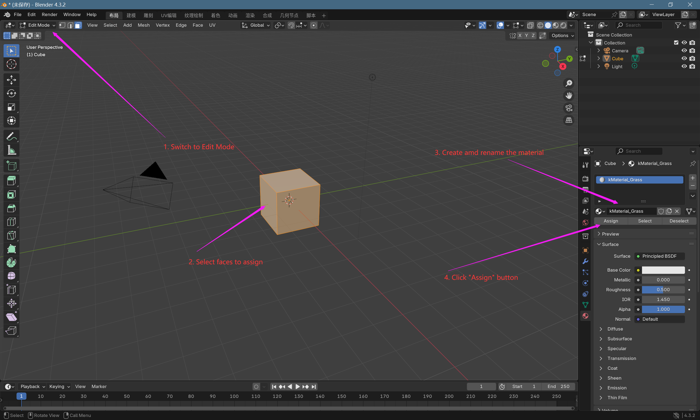

# That Sky Level
A simple level converter for Sky:CotL `BstBaked.meshes` version 0x3C or 0x3D, and a incomplete converter for `Objects.level.bin` version 0x01.

## TODO
1. ❌Supports cloud rendering and collision.
2. ❌Supports 0x3D version of `.meshes`.
3. ❌Fix incorrect object reference of `.level.bin`.

## Usage
### Convert from `.obj` to `.meshes`
Before using the software, the Wavefront .obj file should be prepared. It's recommended to build files with Blender.

Most modeling formats use face materials, but `.meshes` stores data using vertex materials with weights. Therefore, this converter makes some simplifications when exporting to formats like `.obj` that do not support vertex colors, which may result in incorrect material output.

It is recommended to edit raw models with [Blender](https://www.blender.org/). Example operations are as follows:



The material name must start with `kMaterial_`. A complete material table can be found [here](./docs/materials.md).

While export the model as `Wavefront (.obj)` format, the model can be converted to `.meshes` with the command below.

```
node main.js --convert -i <model path> -o <output file>
```

The exported file defaults to version 0x3C, which may be incompatible with the latest version of the game.
